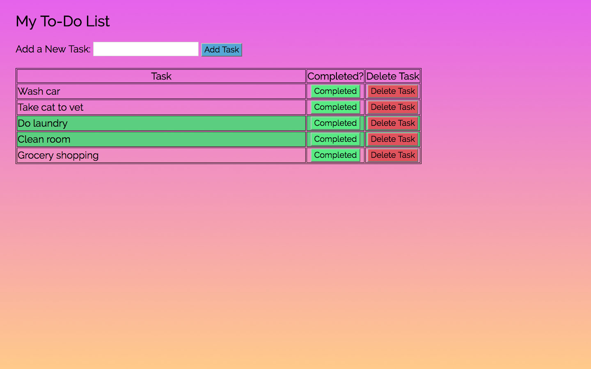

# Weekend Challenge 3: ToDo List App

## Project Description

In this ToDo List app, users can add tasks to a to-do list, mark if they are completed, and delete tasks from their list.

## Technologies Used

- jQuery
- Express
- Node.js
- PostgreSQL

## Table Setup

```
CREATE TABLE "ToDo" (
	"id" serial primary key,
	"taskName" varchar(400) not null,
	"completed" boolean,
	);
```

## Screen Shot



## Completed Features

#### **Base Mode:** 
- [x] Users can add a task to their list
- [x] Users can mark tasks as completed; completed tasks show up in a different color
- [x] Users can delete tasks from their list


#### **Hard Mode:** 

- [ ] Create alert when user presses delete button
- [ ] Add jQuery animation to page when item is added to list
- [ ] Add jQuery animation to page when item is removed from list


#### **Pro Mode:** 
- [ ] Adjust the logic so that completed tasks are brought to the bottom of the page, where the remaining tasks left to complete are brought to the top of the list.
- [ ] Add a due date to your tasks and put the items which need to be completed next at the top of the page. Highlight overdue tasks in red.
- [ ] Add any additional features that you think would be useful or interesting!